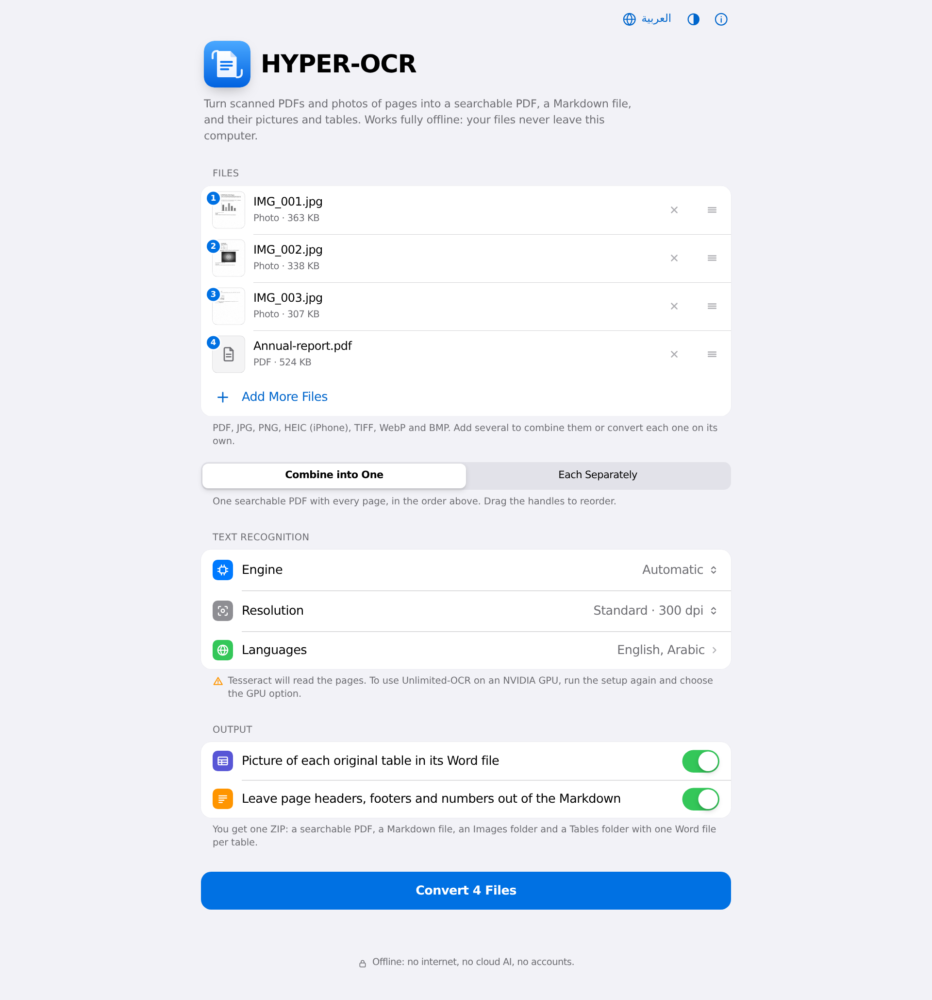
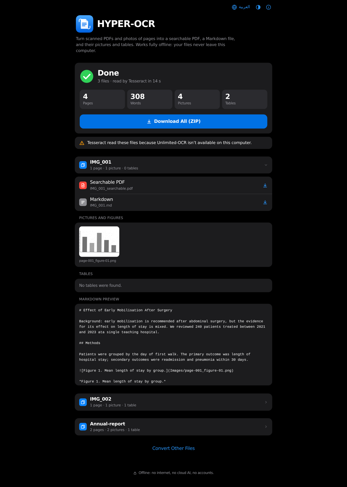
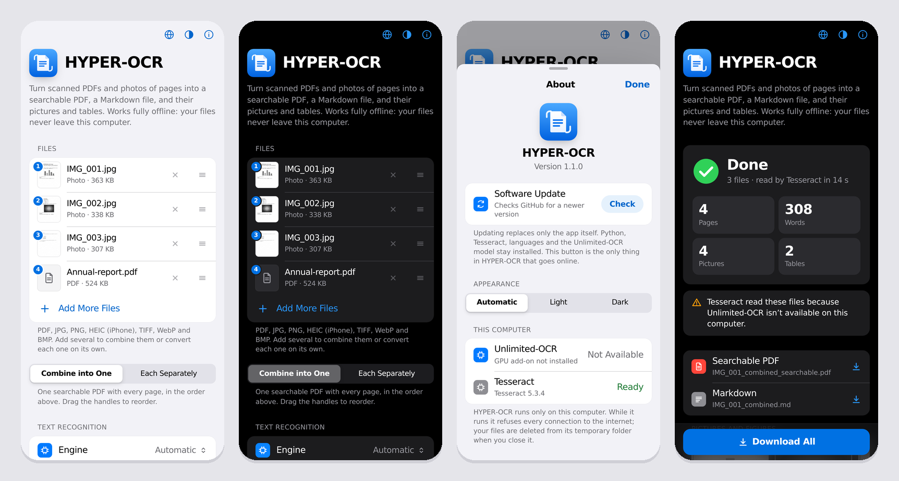
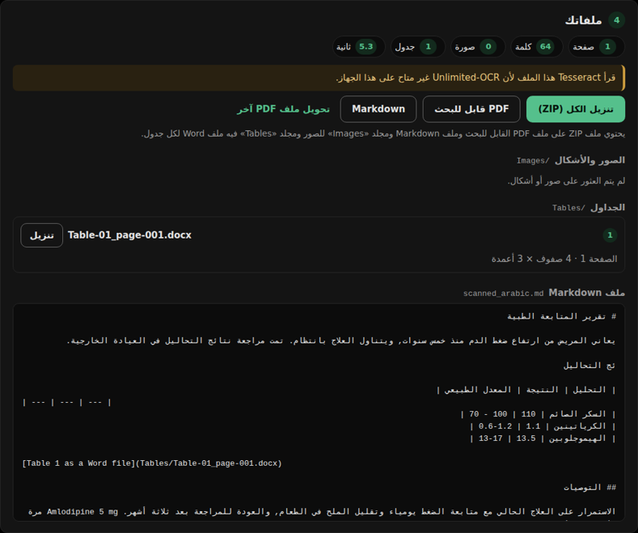

# HYPER-OCR

Turn scanned PDFs and photos of pages into:

- a **searchable PDF**: the original pages, unchanged, with invisible text on top, so you can search, select and copy;
- a **Markdown file**, made with [Microsoft MarkItDown](https://github.com/microsoft/markitdown), with the text, headings, figures, captions and tables in reading order;
- an **`Images` folder** with every picture, chart and figure cut out of the pages;
- a **`Tables` folder** with each table as its own Word file (`.docx`).

Everything runs on your computer. There is no internet connection at run time, no cloud AI and no account. The interface follows Apple's design language (grouped lists, a large title that folds into a frosted bar, segmented controls and spring animations that respond to your hand). It is in English and Arabic, with light and dark appearance, and works in a phone browser too.







## What you get

Click **Download All (ZIP)** and you get one ZIP file:

```
My scan_HYPER-OCR.zip
└── My scan/
    ├── My scan_searchable.pdf      original pages + invisible text + bookmarks from the headings
    ├── My scan.md                  the whole document as Markdown
    ├── Images/
    │   ├── page-001_figure-01.png
    │   └── page-002_figure-01.png
    └── Tables/
        └── Table-01_page-002.docx  one Word file per table
```

Convert several files **each separately** and the ZIP holds one such folder per file, named `HYPER-OCR_3-documents.zip` for three files. **Combine into one** makes a single document from all of them, in the order you set, named after the first file (`IMG_001_combined`).

The Markdown links to its pictures (``) and to each table's Word file, so the folder works as a whole when you unzip it.

Each Word table keeps merged cells, and repeats its header row on every printed page. Arabic tables run right to left. Each file also has the table's caption, the page it came from and, if you leave the option on, a picture of the original table so you can check the numbers.

## Install

You need the internet **once**, during setup. After that the app never goes online.

### Windows 10 or 11

1. Download this folder (on GitHub: **Code → Download ZIP**) and unzip it somewhere, for example in `Documents`.
2. Double-click **`setup-windows.bat`**. It installs, where missing:
   - Python 3.12;
   - Tesseract OCR;
   - the app's packages;
   - the English and Arabic language files.

   If Windows installs Python, it asks you to run the setup once more.
3. If you have an **NVIDIA graphics card**, setup offers to install Unlimited-OCR (see [The two OCR engines](#the-two-ocr-engines)). Answer `Y` to install it now, or `N` to stay with Tesseract.
4. Double-click **`start-windows.bat`**. Your browser opens HYPER-OCR at `http://127.0.0.1:8765`. Keep the black window open while you use the app; close it to stop.

### macOS

1. Install [Homebrew](https://brew.sh) if you don't have it.
2. Open Terminal in this folder and run `./setup.sh`.
3. Start the app by double-clicking **`start-mac.command`**. The first time, macOS may block it: right-click it, choose **Open**, then **Open** again.

Macs have no NVIDIA GPU, so HYPER-OCR uses Tesseract on a Mac.

### Linux

Run `./setup.sh`, then `./start.sh`. On Ubuntu, setup installs Tesseract with `apt` and asks for your password.

## Use

1. **Choose files.** Drop them anywhere on the window, or click the box to pick them. You can mix:
   - scanned PDFs;
   - photos and scans of pages: JPG, PNG, TIFF (multi-page too), WebP, BMP and **HEIC/HEIF from an iPhone**.

   Photos are turned the right way up from their camera orientation, and their page size comes from the picture's resolution (or an A4-sized guess when it has none).
2. **With two or more files, choose how to convert them.**
   - **Combine into One**: one searchable PDF, Markdown and ZIP with every page, in the order of the list. Drag the ☰ handle to reorder, or focus it and press ↑ / ↓.
   - **Each Separately**: every file gets its own searchable PDF, Markdown, `Images` and `Tables`, all in one ZIP.
3. **Text recognition.**
   - *Engine*: leave **Automatic**. It uses Unlimited-OCR when this computer can run it, otherwise Tesseract, and the line under the list says which and why.
   - *Resolution*: 300 dpi suits most scans. Choose 400 dpi for tiny print, or 200 dpi for speed.
   - *Languages*: tick every language that appears. Tesseract needs this; Unlimited-OCR works out the language itself.
   - *Output*: put a picture of the original table in each Word file, and leave page headers, footers and page numbers out of the Markdown.
4. **Convert.** The card shows the page being scanned, the file it belongs to, and the time left. You can cancel at any time.
5. **Your files.** Download the ZIP, or single files: the searchable PDF, the Markdown, each table. When you converted several files separately, tap a file to open its results.

The **ⓘ** button opens **About**: the version, **Software Update**, Automatic / Light / Dark appearance, and what this computer can run. Your choices (appearance, language, engine, resolution, languages, mode) are remembered in this browser.



## Updating

You download HYPER-OCR once. After that, updates replace only the app's own files: Python, the installed packages, Tesseract, the language files and the Unlimited-OCR model all stay, so nothing large is downloaded again.

**In the app:** click **ⓘ**, then **Check** next to *Software Update*. If a newer version exists, the button becomes **Update**. Click it and HYPER-OCR downloads the new version from GitHub, installs it, restarts itself and reloads the page. (The button waits while a conversion is running.)

**Without the app:** double-click **`update-windows.bat`**, or run `./update.sh` on macOS and Linux. Add `--check` to only check, or `--yes` to update without being asked.

What an update does:

1. Reads the version number in `hyperocr/__init__.py` on the repository's default branch, and compares it with yours.
2. Downloads that branch as a ZIP and copies its files over the app. Files that were removed from the app are removed here too. `.venv`, `models`, `tessdata`, `tesseract` and `.backup` are never touched.
3. Keeps the previous version in `.backup/<version>/`. If anything fails while files are being copied, that backup is put back.
4. Reinstalls packages only when the new version's `requirements.txt` differs (and the GPU packages only if they were installed).

Updating is the only thing in HYPER-OCR that goes online, and only when you click it. It runs as a separate program; the converter itself stays offline. The app is started by a small supervisor, so after an update it comes back on its own at the same address.

## The two OCR engines

| | **Unlimited-OCR** (Baidu) | **Tesseract** |
|---|---|---|
| Needs | an NVIDIA graphics card (CUDA) and a one-time model download of several GB | any computer |
| Quality | best: a 3-billion-parameter document model that also recognises tables, figures, headings and formulas | good on clean, printed scans |
| Layout | from the model | from HYPER-OCR's own image analysis: bordered tables (merged cells included), figures, headings, captions |
| Speed | a few seconds a page on a modern GPU | 2 to 5 seconds a page on a laptop processor |

**Automatic** picks Unlimited-OCR when an NVIDIA GPU, the GPU packages and the model are all present. Otherwise it uses Tesseract and the settings card says what is missing.

**To add Unlimited-OCR later** (NVIDIA GPU only), run the setup again and answer `Y`. Or, by hand:

```
.venv\Scripts\python -m pip install torch torchvision --index-url https://download.pytorch.org/whl/cu128
.venv\Scripts\python -m pip install -r requirements-gpu.txt
.venv\Scripts\python -m hyperocr.download_model        (or double-click download-model-windows.bat)
```

On macOS and Linux, use `.venv/bin/python` in place of `.venv\Scripts\python`. The model is saved in `models/Unlimited-OCR` and loaded from there with Hugging Face's offline mode switched on, so it never goes online. If Hugging Face is blocked where you are, use `python -m hyperocr.download_model --source modelscope`.

**Running Unlimited-OCR as a server (Linux, advanced).** If you prefer Baidu's official vLLM or SGLang server (see the [Unlimited-OCR README](https://github.com/baidu/Unlimited-OCR)), start it on this computer. Then start HYPER-OCR with `HYPEROCR_OCR_SERVER=http://127.0.0.1:10000`. A new engine choice, *Unlimited-OCR · local server*, appears. Only `localhost` addresses are accepted.

## Languages

Setup adds English and Arabic. To add more Tesseract languages (one-time download):

```
.venv\Scripts\python -m hyperocr.languages add fra deu spa      (French, German, Spanish)
.venv\Scripts\python -m hyperocr.languages                      (list what is installed)
```

Use Tesseract's codes: `fas` Persian, `urd` Urdu, `tur` Turkish, `chi_sim` Chinese, and so on. Add `--best` for the larger, slower, sometimes more accurate models. The new languages appear as checkboxes the next time you start the app.

## Privacy

- The server listens on `127.0.0.1` only, so other computers on your network cannot reach it. It also refuses requests addressed to any other host name, and changes that don't carry the app's own header, so a website open in another tab cannot use it.
- The page's Content Security Policy forbids any connection except to the app itself. No fonts, scripts or analytics load from anywhere else.
- Uploads and results live in a temporary folder. They are deleted when you click **Convert Other Files**, six hours after a conversion, and when you close the app.
- The only connection HYPER-OCR ever makes is **Software Update**, to `api.github.com` (and GitHub's download server), and only when you click it. It sends no information about you or your files.
- No AI service is called. Unlimited-OCR is a model that runs on your own GPU.
- While it converts, HYPER-OCR refuses every outgoing network connection except to this computer itself. Libraries that can report usage are switched off.
- MarkItDown is installed without its file-type guesser, `magika`. That guesser runs on ONNX Runtime, which contacts Microsoft's telemetry servers as soon as it is loaded. HYPER-OCR always gives MarkItDown HTML, so it doesn't need the guesser, and it blocks ONNX Runtime from loading at all.

## How it works

1. Pictures are first placed on PDF pages, one picture per page (JPEGs are kept byte for byte). Each page is then rendered to an image (300 dpi by default).
2. **Unlimited-OCR** returns the page as tagged blocks: `<|det|>text [113, 567, 884, 698]<|/det|>…`. Each block has a type (title, text, table, image, caption, formula…) and a box on a 0–1000 grid. Tables come back as HTML. The model doesn't report individual lines, so HYPER-OCR finds each block's text lines in the image and spreads the block's words over them.
3. **Tesseract** reads words with their exact positions. First, HYPER-OCR removes scanner specks with a median filter; specks otherwise turn into fake Arabic dots. Then:
   - it finds bordered tables from their ruling lines, merged cells included, and reads each cell separately;
   - it finds figures as large areas of ink that aren't text;
   - it spots headings by letter size and stroke weight, and captions by "Figure 2." / "Table 1." / "شكل" / "جدول";
   - when several languages are ticked, it reads uncertain words with each language alone and keeps the most confident reading. This fixes Arabic words that a mixed model misreads as Latin look-alikes.
4. **Searchable PDF**: the text is written in invisible ink with a "glyphless" font, the method Tesseract and OCRmyPDF use. The original page images are never re-compressed. Arabic is stored in visual order, like born-digital PDFs. Search was tested in:
   - Chrome and Edge (PDFium);
   - Firefox (pdf.js);
   - MuPDF-based readers;
   - Poppler-based readers.

   Pages that already contain real text keep it. An old OCR layer is replaced, not doubled.
5. **Images** are cut out at the scan's own resolution (up to 600 dpi). **Tables** become Word files.
6. **Markdown**: the blocks are assembled into an HTML document in reading order, and Microsoft MarkItDown converts it to Markdown. Formulas come out as `$…$` and `$$…$$` LaTeX.

## Limits

- **Tesseract** finds tables that have **visible borders**. Borderless tables come out as text. Unlimited-OCR handles both.
- Handwriting, stamps and very poor scans read badly with Tesseract.
- At *Fast · 200 dpi*, small digits and decimal points can be misread (a lab range "1.2-0.6" came out as "1.2-06" in testing). Keep 300 dpi or more for documents where numbers matter.
- In Arabic text, searching for a single word works in every viewer. Searching a phrase that mixes Arabic with numbers or English may not, in any viewer; born-digital Arabic PDFs behave the same way.
- Unlimited-OCR needs an NVIDIA GPU with CUDA. Apple Silicon is not supported by Baidu's code, so Macs use Tesseract.
- This build was tested with Tesseract on English and Arabic scans. Baidu's GPU model could not be run in the build environment (no GPU there). The Unlimited-OCR path is written to Baidu's published usage and output format, and tested end to end with simulated model output in that format.

## Troubleshooting

| Message or problem | What to do |
|---|---|
| "Tesseract isn't installed" | Run the setup again. On Windows you can also install it from <https://github.com/UB-Mannheim/tesseract/wiki>. |
| "The GPU add-on isn't installed" | Only matters with an NVIDIA GPU: run the setup again and answer `Y`. |
| "The Unlimited-OCR model isn't downloaded yet" | Run `download-model-windows.bat` (or `./download-model.sh`) once, then restart the app. |
| "This PDF is password-protected" | Open it, save a copy without the password, and convert the copy. |
| A language is missing from the list | `python -m hyperocr.languages add <code>` (see [Languages](#languages)), then restart. |
| The browser didn't open | Open <http://127.0.0.1:8765> yourself. If that port was taken, the black window shows the address it used. |
| Out of memory on a huge PDF | Choose *Fast · 200 dpi*, or split the PDF. |
| An iPhone photo shows a plain icon instead of a preview | Normal: most browsers can't show HEIC. HYPER-OCR still reads it. |
| "Couldn't reach GitHub" when updating | Check the internet connection and try again. Nothing was changed. |
| An update failed | The previous version was restored from `.backup/`. Try again, or run `update-windows.bat` / `./update.sh` to see the details. |
| The page didn't come back after an update | Close the black window and start the app again. |

## For developers

```
python -m venv .venv && .venv/bin/pip install -r requirements-dev.txt
.venv/bin/pip install --no-deps "markitdown>=0.1.2,<0.2"     # without magika / onnxruntime, as setup does
.venv/bin/python -m pytest          # 53 tests; the CPU tests need Tesseract with eng + ara
.venv/bin/python tests/fixtures/make_fixtures.py   # rebuild the scanned test PDFs
```

```
hyperocr/
  __main__.py          supervisor: starts the local server, restarts it after an update
  server.py, jobs.py   JSON API on 127.0.0.1, one worker thread, clean-up
  inputs.py            uploads: PDFs and pictures (HEIC, EXIF orientation), combined or one by one
  pipeline.py          one conversion, start to finish
  update.py            the updater (the only code that goes online, run as its own process)
  document.py          the page model every engine fills in
  engines/
    unlimited.py       Unlimited-OCR (transformers on CUDA, or a local vLLM/SGLang server)
    detparse.py        parser for Unlimited-OCR's tagged output
    tesseract_engine.py, layout_cv.py   Tesseract plus OpenCV layout analysis
  outputs/
    textlayer.py       invisible searchable text (glyphless font, bidi-aware)
    images.py, tables.py, tablegrid.py, markdown.py
  static/              the interface (no external resources)
    style.css          Apple-style tokens and components, light and dark
    motion.js          springs (damping + response), momentum projection, rubber-banding
    app.js, i18n.js    the page, English and Arabic
design-system/         the original "Attendance Register" design system (version 1.0's look)
```

Since version 1.1 the interface uses Apple's system colours, type scale and components, in `hyperocr/static/style.css`. Every colour is a token with a light and a dark value, secondary text uses Apple's higher-contrast greys so it passes WCAG AA, and the page honours *Reduce Motion*, *Reduce Transparency* and *Increase Contrast*. Animations are springs that start from where things are now, so you can interrupt any of them: a dragged row, a sheet you pull down, the segmented control.

`design-system/` keeps the green **Attendance Register** design system that version 1.0 used. It is still published in Claude Design; `python design-system/build_css.py` writes its CSS to `design-system/build/`.

## Credits and licences

- [Unlimited-OCR](https://github.com/baidu/Unlimited-OCR) by Baidu (MIT)
- [MarkItDown](https://github.com/microsoft/markitdown) by Microsoft (MIT)
- [Tesseract OCR](https://github.com/tesseract-ocr/tesseract) (Apache 2.0); HYPER-OCR also bundles Tesseract's 572-byte glyphless font, `hyperocr/outputs/glyphless.ttf`, under the same licence
- [pi-heif](https://pypi.org/project/pi-heif/) for iPhone photos: the decode-only edition of pillow-heif (BSD-3-Clause), bundling [libheif](https://github.com/strukturag/libheif) and [libde265](https://github.com/strukturag/libde265) (LGPL-3.0)

See [THIRD_PARTY_NOTICES.md](THIRD_PARTY_NOTICES.md) for every library and its licence. Note that PyMuPDF is AGPL-3.0, which matters if you ever distribute HYPER-OCR or run it as a service for others.

**iPhone photos (HEIC).** All the software HYPER-OCR uses to read them is free and open source; there is nothing to pay. HEIC pictures are compressed with HEVC (H.265), a video format covered by patents that are licensed through patent pools ([Access Advance](https://accessadvance.com/licensing-programs/hevc-advance/), [Via LA](https://www.via-la.com/licensing-programs/hevc-vvc/)). Those licences are taken by companies that sell devices or software with HEVC built in, and are paid per unit sold. Using HYPER-OCR yourself, or inside your organisation, involves no sale. If you plan to sell or distribute HYPER-OCR, get legal advice on HEVC first, or remove HEIC support by uninstalling `pi-heif`; every other format keeps working.
