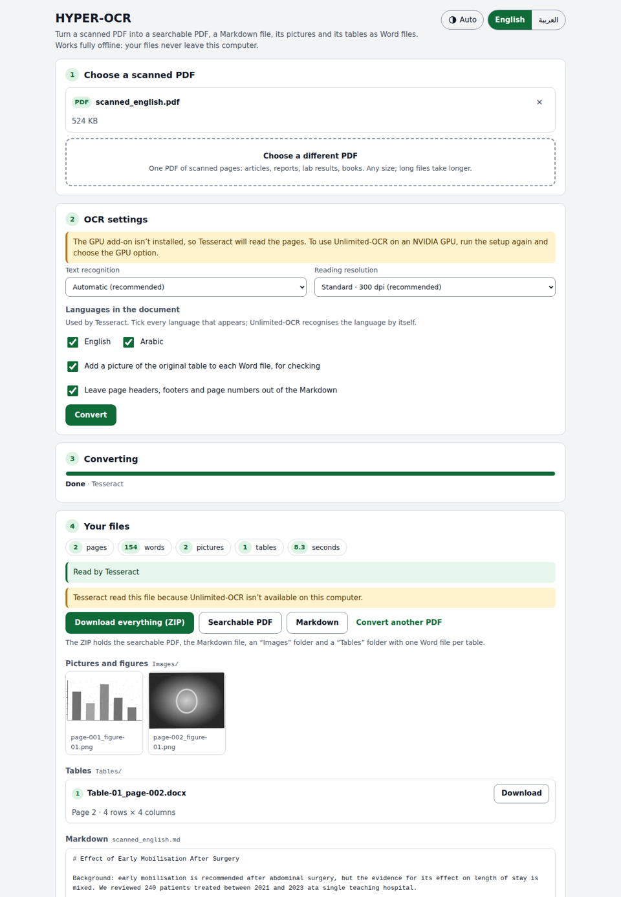

# HYPER-OCR

Turn a scanned PDF into:

- a **searchable PDF**: the original pages, unchanged, with invisible text on top, so you can search, select and copy;
- a **Markdown file**, made with [Microsoft MarkItDown](https://github.com/microsoft/markitdown), with the text, headings, figures, captions and tables in reading order;
- an **`Images` folder** with every picture, chart and figure cut out of the pages;
- a **`Tables` folder** with each table as its own Word file (`.docx`).

Everything runs on your computer. There is no internet connection at run time, no cloud AI and no account. The interface is in English and Arabic, with light and dark themes, and works on a phone browser too.



## What you get

Click **Download everything (ZIP)** and you get one ZIP file:

```
My scan_HYPER-OCR.zip
└── My scan/
    ├── My scan_searchable.pdf      original pages + invisible text + bookmarks from the headings
    ├── My scan.md                  the whole document as Markdown
    ├── Images/
    │   ├── page-001_figure-01.png
    │   └── page-002_figure-01.png
    └── Tables/
        └── Table-01_page-002.docx  one Word file per table
```

The Markdown links to its pictures (``) and to each table's Word file, so the folder works as a whole when you unzip it.

Each Word table keeps merged cells, and repeats its header row on every printed page. Arabic tables run right to left. Each file also has the table's caption, the page it came from and, if you leave the option on, a picture of the original table so you can check the numbers.

## Install

You need the internet **once**, during setup. After that the app never goes online.

### Windows 10 or 11

1. Download this folder (on GitHub: **Code → Download ZIP**) and unzip it somewhere, for example in `Documents`.
2. Double-click **`setup-windows.bat`**. It installs, where missing:
   - Python 3.12;
   - Tesseract OCR;
   - the app's packages;
   - the English and Arabic language files.

   If Windows installs Python, it asks you to run the setup once more.
3. If you have an **NVIDIA graphics card**, setup offers to install Unlimited-OCR (see [The two OCR engines](#the-two-ocr-engines)). Answer `Y` to install it now, or `N` to stay with Tesseract.
4. Double-click **`start-windows.bat`**. Your browser opens HYPER-OCR at `http://127.0.0.1:8765`. Keep the black window open while you use the app; close it to stop.

### macOS

1. Install [Homebrew](https://brew.sh) if you don't have it.
2. Open Terminal in this folder and run `./setup.sh`.
3. Start the app by double-clicking **`start-mac.command`**. The first time, macOS may block it: right-click it, choose **Open**, then **Open** again.

Macs have no NVIDIA GPU, so HYPER-OCR uses Tesseract on a Mac.

### Linux

Run `./setup.sh`, then `./start.sh`. On Ubuntu, setup installs Tesseract with `apt` and asks for your password.

## Use

1. **Choose a scanned PDF.** Drop it on the box or click to pick it.
2. **OCR settings.**
   - *Text recognition*: leave **Automatic**. It uses Unlimited-OCR when this computer can run it, otherwise Tesseract, and tells you which and why.
   - *Reading resolution*: 300 dpi suits most scans. Choose 400 dpi for tiny print, or 200 dpi for speed.
   - *Languages in the document*: tick every language that appears. Tesseract needs this; Unlimited-OCR works out the language itself.
   - Two options: put a picture of the original table in each Word file, and leave page headers, footers and page numbers out of the Markdown.
3. **Convert.** A progress bar shows the page being read. You can cancel at any time.
4. **Your files.** Download the ZIP, or just the searchable PDF or the Markdown. You can also preview the pictures, download single tables and read the Markdown in place.


## The two OCR engines

| | **Unlimited-OCR** (Baidu) | **Tesseract** |
|---|---|---|
| Needs | an NVIDIA graphics card (CUDA) and a one-time model download of several GB | any computer |
| Quality | best: a 3-billion-parameter document model that also recognises tables, figures, headings and formulas | good on clean, printed scans |
| Layout | from the model | from HYPER-OCR's own image analysis: bordered tables (merged cells included), figures, headings, captions |
| Speed | a few seconds a page on a modern GPU | 2 to 5 seconds a page on a laptop processor |

**Automatic** picks Unlimited-OCR when an NVIDIA GPU, the GPU packages and the model are all present. Otherwise it uses Tesseract and the settings card says what is missing.

**To add Unlimited-OCR later** (NVIDIA GPU only), run the setup again and answer `Y`. Or, by hand:

```
.venv\Scripts\python -m pip install torch torchvision --index-url https://download.pytorch.org/whl/cu128
.venv\Scripts\python -m pip install -r requirements-gpu.txt
.venv\Scripts\python -m hyperocr.download_model        (or double-click download-model-windows.bat)
```

On macOS and Linux, use `.venv/bin/python` in place of `.venv\Scripts\python`. The model is saved in `models/Unlimited-OCR` and loaded from there with Hugging Face's offline mode switched on, so it never goes online. If Hugging Face is blocked where you are, use `python -m hyperocr.download_model --source modelscope`.

**Running Unlimited-OCR as a server (Linux, advanced).** If you prefer Baidu's official vLLM or SGLang server (see the [Unlimited-OCR README](https://github.com/baidu/Unlimited-OCR)), start it on this computer. Then start HYPER-OCR with `HYPEROCR_OCR_SERVER=http://127.0.0.1:10000`. A new engine choice, *Unlimited-OCR · local server*, appears. Only `localhost` addresses are accepted.

## Languages

Setup adds English and Arabic. To add more Tesseract languages (one-time download):

```
.venv\Scripts\python -m hyperocr.languages add fra deu spa      (French, German, Spanish)
.venv\Scripts\python -m hyperocr.languages                      (list what is installed)
```

Use Tesseract's codes: `fas` Persian, `urd` Urdu, `tur` Turkish, `chi_sim` Chinese, and so on. Add `--best` for the larger, slower, sometimes more accurate models. The new languages appear as checkboxes the next time you start the app.

## Privacy

- The server listens on `127.0.0.1` only, so other computers on your network cannot reach it. It also refuses requests addressed to any other host name, and changes that don't carry the app's own header, so a website open in another tab cannot use it.
- The page's Content Security Policy forbids any connection except to the app itself. No fonts, scripts or analytics load from anywhere else.
- Uploads and results live in a temporary folder. They are deleted when you click **Convert another PDF**, six hours after a conversion, and when you close the app.
- No AI service is called. Unlimited-OCR is a model that runs on your own GPU.
- While it runs, HYPER-OCR refuses every outgoing network connection except to this computer itself. Libraries that can report usage are switched off.
- MarkItDown is installed without its file-type guesser, `magika`. That guesser runs on ONNX Runtime, which contacts Microsoft's telemetry servers as soon as it is loaded. HYPER-OCR always gives MarkItDown HTML, so it doesn't need the guesser, and it blocks ONNX Runtime from loading at all.

## How it works

1. Each page is rendered to an image (300 dpi by default).
2. **Unlimited-OCR** returns the page as tagged blocks: `<|det|>text [113, 567, 884, 698]<|/det|>…`. Each block has a type (title, text, table, image, caption, formula…) and a box on a 0–1000 grid. Tables come back as HTML. The model doesn't report individual lines, so HYPER-OCR finds each block's text lines in the image and spreads the block's words over them.
3. **Tesseract** reads words with their exact positions. First, HYPER-OCR removes scanner specks with a median filter; specks otherwise turn into fake Arabic dots. Then:
   - it finds bordered tables from their ruling lines, merged cells included, and reads each cell separately;
   - it finds figures as large areas of ink that aren't text;
   - it spots headings by letter size and stroke weight, and captions by "Figure 2." / "Table 1." / "شكل" / "جدول";
   - when several languages are ticked, it reads uncertain words with each language alone and keeps the most confident reading. This fixes Arabic words that a mixed model misreads as Latin look-alikes.
4. **Searchable PDF**: the text is written in invisible ink with a "glyphless" font, the method Tesseract and OCRmyPDF use. The original page images are never re-compressed. Arabic is stored in visual order, like born-digital PDFs. Search was tested in:
   - Chrome and Edge (PDFium);
   - Firefox (pdf.js);
   - MuPDF-based readers;
   - Poppler-based readers.

   Pages that already contain real text keep it. An old OCR layer is replaced, not doubled.
5. **Images** are cut out at the scan's own resolution (up to 600 dpi). **Tables** become Word files.
6. **Markdown**: the blocks are assembled into an HTML document in reading order, and Microsoft MarkItDown converts it to Markdown. Formulas come out as `$…$` and `$$…$$` LaTeX.

## Limits

- **Tesseract** finds tables that have **visible borders**. Borderless tables come out as text. Unlimited-OCR handles both.
- Handwriting, stamps and very poor scans read badly with Tesseract.
- In Arabic text, searching for a single word works in every viewer. Searching a phrase that mixes Arabic with numbers or English may not, in any viewer; born-digital Arabic PDFs behave the same way.
- Unlimited-OCR needs an NVIDIA GPU with CUDA. Apple Silicon is not supported by Baidu's code, so Macs use Tesseract.
- This build was tested with Tesseract on English and Arabic scans. Baidu's GPU model could not be run in the build environment (no GPU there). The Unlimited-OCR path is written to Baidu's published usage and output format, and tested end to end with simulated model output in that format.

## Troubleshooting

| Message or problem | What to do |
|---|---|
| "Tesseract isn't installed" | Run the setup again. On Windows you can also install it from <https://github.com/UB-Mannheim/tesseract/wiki>. |
| "The GPU add-on isn't installed" | Only matters with an NVIDIA GPU: run the setup again and answer `Y`. |
| "The Unlimited-OCR model isn't downloaded yet" | Run `download-model-windows.bat` (or `./download-model.sh`) once, then restart the app. |
| "This PDF is password-protected" | Open it, save a copy without the password, and convert the copy. |
| A language is missing from the list | `python -m hyperocr.languages add <code>` (see [Languages](#languages)), then restart. |
| The browser didn't open | Open <http://127.0.0.1:8765> yourself. If that port was taken, the black window shows the address it used. |
| Out of memory on a huge PDF | Choose *Fast · 200 dpi*, or split the PDF. |

## For developers

```
python -m venv .venv && .venv/bin/pip install -r requirements-dev.txt
.venv/bin/pip install --no-deps "markitdown>=0.1.2,<0.2"     # without magika / onnxruntime, as setup does
.venv/bin/python -m pytest          # 39 tests; the CPU tests need Tesseract with eng + ara
.venv/bin/python tests/fixtures/make_fixtures.py   # rebuild the scanned test PDFs
```

```
hyperocr/
  __main__.py          start the local server and open the browser
  server.py, jobs.py   JSON API on 127.0.0.1, one worker thread, clean-up
  pipeline.py          one conversion, start to finish
  document.py          the page model every engine fills in
  engines/
    unlimited.py       Unlimited-OCR (transformers on CUDA, or a local vLLM/SGLang server)
    detparse.py        parser for Unlimited-OCR's tagged output
    tesseract_engine.py, layout_cv.py   Tesseract plus OpenCV layout analysis
  outputs/
    textlayer.py       invisible searchable text (glyphless font, bidi-aware)
    images.py, tables.py, tablegrid.py, markdown.py
  static/              the interface (no external resources)
design-system/         the "Attendance Register" design system the interface is built on
```

The interface uses the **Attendance Register** design system, taken from the *Attendance Register Filler* app. `design-system/tokens.json` holds its colours, type, spacing and radii, and `design-system/README.md` is its brand book. After editing the tokens, run `python design-system/build_css.py` to regenerate `hyperocr/static/tokens.css`. The same system is published in Claude Design.

## Credits and licences

- [Unlimited-OCR](https://github.com/baidu/Unlimited-OCR) by Baidu (MIT)
- [MarkItDown](https://github.com/microsoft/markitdown) by Microsoft (MIT)
- [Tesseract OCR](https://github.com/tesseract-ocr/tesseract) (Apache 2.0); HYPER-OCR also bundles Tesseract's 572-byte glyphless font, `hyperocr/outputs/glyphless.ttf`, under the same licence

See [THIRD_PARTY_NOTICES.md](THIRD_PARTY_NOTICES.md) for every library and its licence. Note that PyMuPDF is AGPL-3.0, which matters if you ever distribute HYPER-OCR as a service.
